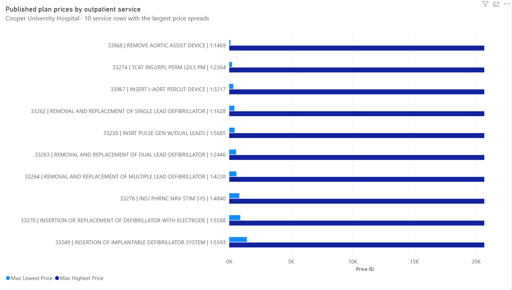
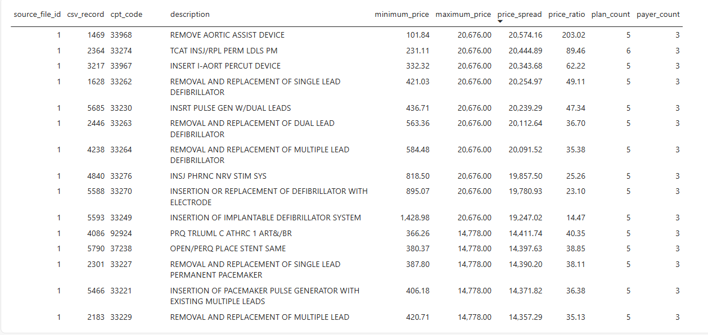

# Cooper Price Analytics

How much do insurance plans list for the same outpatient service at Cooper University Hospital? This project compares published negotiated prices and examines how payment terms affect those differences.

Built with Python, PostgreSQL, Metabase, and Power BI.

## Findings

The analysis covers **9,495 outpatient service records** with at least two eligible plan prices. Excluding rates with “lesser of” payment notes leaves **9,205 records** that can still be compared.

Across those same 9,205 records, the median difference between the highest and lowest price falls from **$1,436 to $758 — a 47.2% decrease**. Payment terms make a substantial difference to the measured price spread.

These are published prices, not patient bills or actual insurer payments. Service records are not necessarily unique procedures.

## Power BI

The chart shows the ten service records with the largest price spreads in the initial comparison, before excluding rates with “lesser of” notes. These are selected extremes, not typical prices across all services.

[](reports/image_2.png)

The table adds exact prices, ratios, and the number of plans and insurers represented. All price amounts are in dollars.

[](reports/image_1.png)

For example, CPT 33968 ranges from $101.84 to $20,676 across five plans. The highest rate carries a “lesser of” note, illustrating why payment terms matter when interpreting these differences.

[Download the Power BI report](reports/Cooper.pbix) to inspect the visuals in Power BI Desktop. The 47.2% finding above comes from the separate [SQL sensitivity analysis](sql/price_sensitivity.sql).

## Data and method

The source is [Cooper's public hospital pricing data](https://www.cooperhealth.org/patients-and-visitors/financial-and-insurance-information/pricing-and-transparency). Results use Cooper's June 23, 2026 file. Cape Regional's July 1, 2026 file is also loaded but excluded from this analysis.

Python checks and imports the CSVs into PostgreSQL. SQL compares positive, fee-schedule dollar prices for outpatient facility services with a primary CPT code, excluding drug services and rates expressed with percentages or formulas. Metabase supports detailed inspection; Power BI displays the results.

[Data notes](docs/data_notes.md) explain the tables, filters, and limitations.

## Run locally

Requires [uv](https://docs.astral.sh/uv/getting-started/installation/) and [Docker Compose](https://docs.docker.com/compose/install/).

Download both files into `data/raw/`:

- [Cooper CSV](https://request.cooperhealth.org/financial/210634462_Cooper-University-Hospital_standardcharges.csv) as `cooper.csv`
- [Cape Regional CSV](https://request.cooperhealth.org/financial/210662542_Cooper-University-Hospital-Cape-Regional_standardcharges.csv) as `cape_regional.csv`

New downloads may contain different data. CSVs are excluded from Git.

```bash
uv sync --locked
cp -n .env.example .env
docker compose up -d --wait
uv run python scripts/load_data.py
```

Open **http://localhost:3000** and add a PostgreSQL connection with these defaults, or your `.env` values:

```text
Host: postgres       Port: 5432
Database: cooper     Schema: analytics
Username: cooper     Password: cooperpass
```

Run these files in Metabase's SQL editor:

| Query | Purpose |
| --- | --- |
| [check_load.sql](sql/check_load.sql) | Check import completeness |
| [price_spread.sql](sql/price_spread.sql) | Compare plan prices for each service record |
| [price_sensitivity.sql](sql/price_sensitivity.sql) | Measure the effect of excluding “lesser of” rates |

The sensitivity query uses `source_file_id = 1`; check that it identifies the intended Cooper file in `analytics.source_file`.

Reloading identical files does not duplicate data. Stop containers with `docker compose stop`; restart with `docker compose up -d --wait`. **`docker compose down -v` deletes saved databases and dashboards.**
